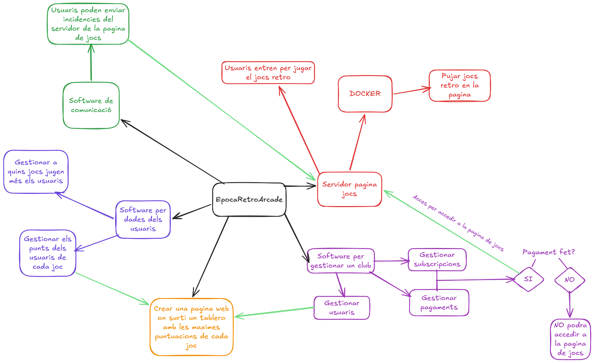

# Projecte Retro Game Club (RetroArcade.cat)
- - - 
## Que volem fer?
Volem crear un club de "Retro Gaming" on poder emular jocs antics, bloquejats i fer un club on la gent pugui pagar una subscripció perque puguin jugar a tots el jocs que estiguin disponibles i proximament potser poder fer torneigos contra el usuaris, que els usuaris faguin una promoció del nostre projecte i que tinguin a cambi: (un mes de subscripció gratis...)
---
### Que necessitem?
  * Un software que ens permeteixi fer subscripcions per als clients (**berrly.com**)
  * Un software amb un docker que ens permeteixi pujar el nostres "ROMS" per emular els nostres jocs en una pagina web (**retroassembly.com**)
  * Un software per gestionar el club de "Retro Gaming" on podem veure els usuaris, que jugen més... (**sportmember.es**)
  * Una base de dades
  * Un software on es pugin entrar tots els clients per informar d'incidencies dels jocs... per si hi ha una actualització on afageixen un joc nou i un altre joc que ja i era peta que es pugui avisar (un tipus de discord on estigui tots els clients i els desarrolladors i pugin parlar entre ells per intentar arreglar els problemes) (**SLACK**,**berrly.com**)
---
#### Disseny Projecte
  